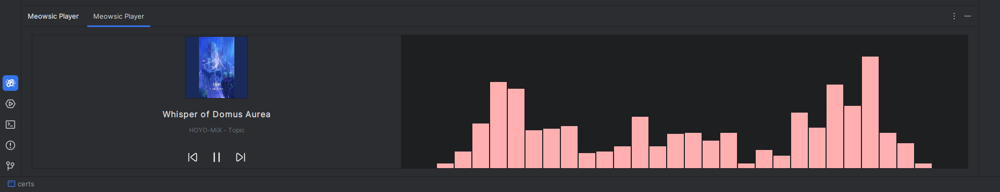

# jetbrain-music-player

<!-- Plugin description -->
Integrate music player and visualizer to your IDE

## Features
- Track music players and display currently playing tracks
- Audio visualization
- Control playback (play/pause, next/previous track)
- Album art display (Linux/Windows)
- Global and local keyboard shortcuts
- Automatic player detection and switching

## Usage
The plugin supports cross-platform music control with different backends:
- **Linux**: Uses "playerctl" for music control
- **Windows**: Uses PowerShell Media.SoundPlayer integration
- **macOS**: Uses AppleScript for music control

### Setup Instructions:
- Install the plugin
- **Linux users**: Install "playerctl" and "cava" for full functionality
- **Windows/macOS users**: No additional dependencies required
- Open the music player tool window (View → Tool Windows → Meowsic Player)
- Start playing music using your favorite music player (e.g. Spotify, VLC, etc.)

## Requirements

### Linux
- [playerctl](https://github.com/altdesktop/playerctl) - For music playback control
- [cava](https://github.com/karlstav/cava) - For audio visualization

### Windows & macOS
- No additional dependencies required

<!-- Plugin description end -->

## Screenshot

## Installation

- Using the IDE built-in plugin system:
  
  <kbd>Settings/Preferences</kbd> > <kbd>Plugins</kbd> > <kbd>Marketplace</kbd> > <kbd>Search for "jetbrain-music-player"</kbd> >
  <kbd>Install</kbd>
  
- Using JetBrains Marketplace:

  Go to [JetBrains Marketplace](https://plugins.jetbrains.com/plugin/28287-meowsic-player) and install it by clicking the <kbd>Install to ...</kbd> button in case your IDE is running.

  You can also download the [latest release](https://plugins.jetbrains.com/plugin/28287-meowsic-player/versions) from JetBrains Marketplace and install it manually using
  <kbd>Settings/Preferences</kbd> > <kbd>Plugins</kbd> > <kbd>⚙️</kbd> > <kbd>Install plugin from disk...</kbd>

- Manually:

  Download the [latest release](https://github.com/Emii-lia/jetbrain-music-player/releases/latest) and install it manually using
  <kbd>Settings/Preferences</kbd> > <kbd>Plugins</kbd> > <kbd>⚙️</kbd> > <kbd>Install plugin from disk...</kbd>

## Keyboard Shortcuts

### Global Shortcuts (work anywhere in IDE):
- **Shift+Space**: Play/Pause music
- **Alt+Period (.)**: Next track
- **Alt+Comma (,)**: Previous track
- **Shift+W**: Show/Hide Music Player tool window

### Tool Window Local Shortcuts (when tool window is focused):
- **Space**: Play/Pause music
- **Right Arrow** or **N**: Next track
- **Left Arrow** or **P**: Previous track

## To Do
- [ ] More playback controls (seek, volume, shuffle, repeat)
- [ ] Customizable visualizer themes and styles
- [ ] Playlist management

## Licence

This project is licensed under the MIT License - see the [LICENSE](LICENSE) file for details.

---
Plugin based on the [IntelliJ Platform Plugin Template][template].

[template]: https://github.com/JetBrains/intellij-platform-plugin-template
[docs:plugin-description]: https://plugins.jetbrains.com/docs/intellij/plugin-user-experience.html#plugin-description-and-presentation
